# 📚 Perpustakaan Digital (Digital Library)

<p align="center">
  
  
  
  
  
</p>

<p align="center">
  Sistem Perpustakaan Digital modern dengan fitur peminjaman buku, ulasan, rekomendasi cerdas berbasis algoritma hybrid, dan manajemen denda otomatis.
</p>

---

## 📋 Daftar Isi

- [Fitur Utama](#-fitur-utama)
- [Arsitektur Sistem](#-arsitektur-sistem)
- [Tech Stack](#-tech-stack)
- [Instalasi](#-instalasi)
- [ERD (Entity Relationship Diagram)](#-erd-entity-relationship-diagram)
- [Class Diagram](#-class-diagram)
- [Use Case Diagram](#-use-case-diagram)
- [Activity Diagrams](#-activity-diagrams)
- [Sequence Diagrams](#-sequence-diagrams)
- [State Diagram](#-state-diagram)
- [Struktur Database](#-struktur-database)
- [API Routes](#-api-routes)
- [Testing](#-testing)
- [Screenshots](#-screenshots)
- [Kontributor](#-kontributor)
- [Lisensi](#-lisensi)

---

## ✨ Fitur Utama

### 👤 Member (Anggota)
- 📖 Browse & search katalog buku dengan filter kategori
- 📝 Request peminjaman buku online
- ⭐ Tulis ulasan dan rating buku (1-5 bintang)
- 👍 Vote helpful/not helpful pada ulasan
- 🔄 Perpanjang peminjaman (max 5x)
- 💡 Rekomendasi buku personal berbasis AI (Hybrid Algorithm)
- 💰 Lihat dan bayar denda keterlambatan
- 🔔 Notifikasi real-time

### 👨‍💼 Librarian (Pustakawan)
- ✅ Approve/reject permintaan peminjaman
- 📦 Konfirmasi pengambilan buku
- 📥 Proses pengembalian buku
- 🔍 Moderasi ulasan buku
- 💵 Kelola pembayaran denda
- 📊 Dashboard statistik peminjaman

### 👑 Admin
- 📚 CRUD manajemen buku
- 📁 CRUD manajemen kategori (hierarchical)
- 👥 CRUD manajemen user
- 🚫 Suspend/activate user
- 📈 Dashboard analytics lengkap

---

## 🏗 Arsitektur Sistem

```
┌─────────────────────────────────────────────────────────────┐
│                     PRESENTATION LAYER                       │
│  ┌──────────────────────────────────────────────────────┐   │
│  │              Blade Templates + Tailwind CSS           │   │
│  │                  (Responsive Design)                  │   │
│  └──────────────────────────────────────────────────────┘   │
└─────────────────────────────────────────────────────────────┘
                            │
                            ▼
┌─────────────────────────────────────────────────────────────┐
│                     APPLICATION LAYER                        │
│  ┌──────────────────────────────────────────────────────┐   │
│  │              Laravel 12 MVC Framework                 │   │
│  └──────────────────────────────────────────────────────┘   │
│                                                              │
│  ┌──────────┐  ┌──────────┐  ┌──────────┐  ┌──────────┐   │
│  │   Auth   │  │  Catalog │  │   Loan   │  │  Review  │   │
│  │  Module  │  │  Module  │  │  Module  │  │  Module  │   │
│  └──────────┘  └──────────┘  └──────────┘  └──────────┘   │
│                                                              │
│  ┌──────────┐  ┌──────────┐  ┌──────────┐                  │
│  │  Notif   │  │  Recom   │  │   Fine   │                  │
│  │  Module  │  │  Engine  │  │  Module  │                  │
│  └──────────┘  └──────────┘  └──────────┘                  │
└─────────────────────────────────────────────────────────────┘
                            │
                            ▼
┌─────────────────────────────────────────────────────────────┐
│                       DATA LAYER                             │
│  ┌──────────────────────────────────────────────────────┐   │
│  │                    MySQL 8.0+                         │   │
│  │              Eloquent ORM + Migrations                │   │
│  └──────────────────────────────────────────────────────┘   │
└─────────────────────────────────────────────────────────────┘
```

---

## 🛠 Tech Stack

| Category | Technology |
|----------|------------|
| **Backend Framework** | Laravel 12.x |
| **Frontend** | Blade Templates, Tailwind CSS 3.x, Alpine.js |
| **Database** | MySQL 8.0+ |
| **Authentication** | Laravel Breeze |
| **Authorization** | Spatie Laravel Permission 6.x |
| **Build Tools** | Vite, PostCSS |
| **Testing** | PHPUnit 11.x |
| **PHP Version** | 8.2+ |

---

## 🚀 Instalasi

### Prerequisites
- PHP 8.2 atau lebih tinggi
- Composer 2.x
- MySQL 8.0+
- Node.js 18+ & npm

### Langkah Instalasi

```bash
# 1. Clone repository
git clone https://github.com/username/digital-library.git
cd digital-library

# 2. Install PHP dependencies
composer install

# 3. Copy environment file
cp .env.example .env

# 4. Generate application key
php artisan key:generate

# 5. Konfigurasi database di .env
# DB_CONNECTION=mysql
# DB_HOST=127.0.0.1
# DB_PORT=3306
# DB_DATABASE=perpusrpldb
# DB_USERNAME=root
# DB_PASSWORD=your_password

# 6. Jalankan migrasi dan seeder
php artisan migrate --seed

# 7. Install Node dependencies
npm install

# 8. Build assets
npm run build

# 9. Jalankan development server
php artisan serve
```

### Quick Start dengan Composer Script

```bash
# Setup lengkap (install, migrate, build)
composer setup

# Development mode (server, queue, logs, vite)
composer dev

# Jalankan tests
composer test
```

---

## 📊 ERD (Entity Relationship Diagram)


---

## 📐 Class Diagram


---

## 🎭 Use Case Diagram


---

## 🔄 Activity Diagrams

### Flowchart Proses Peminjaman


### Flowchart Proses Pengembalian

```mermaid
flowchart TD
    Start([User Kembalikan Buku]) --> ScanBook[Pustakawan Cek Data Peminjaman]
    ScanBook --> FindLoan[Cari Data Peminjaman di Database]
    FindLoan --> CheckLoan{Data<br/>Ditemukan?}
    
    CheckLoan -->|Tidak| Error1[Tampilkan Error:<br/>Data Tidak Ditemukan]
    Error1 --> End1([Selesai])
    
    CheckLoan -->|Ya| CheckStatus{Status<br/>Peminjaman?}
    CheckStatus -->|Bukan Active| Error2[Tampilkan Error:<br/>Status Tidak Valid]
    Error2 --> End2([Selesai])
    
    CheckStatus -->|Active| GetDates[Ambil Due Date & Return Date]
    GetDates --> CalcDays[Hitung Selisih Hari:<br/>Days = Return Date - Due Date]
    CalcDays --> CheckOverdue{Days > 0?<br/>Terlambat?}
    
    CheckOverdue -->|Tidak| NoFine[Tidak Ada Denda]
    NoFine --> UpdateReturn[Update Loan:<br/>Status = Returned<br/>Return Date = Today]
    
    CheckOverdue -->|Ya| CheckGrace{Days <= 3?<br/>Grace Period?}
    CheckGrace -->|Ya| NoFine
    
    CheckGrace -->|Tidak| CalcFine[Hitung Denda:<br/>Fine = Days × Rp 1000]
    CalcFine --> CheckMax{Fine ><br/>Rp 50000?}
    CheckMax -->|Ya| SetMax[Set Fine = Rp 50000]
    CheckMax -->|Tidak| UseFine[Gunakan Fine yang Dihitung]
    
    SetMax --> CreateFine[Buat Record di Tabel FINES<br/>Status: Unpaid]
    UseFine --> CreateFine
    CreateFine --> NotifFine[Kirim Notifikasi Denda ke User]
    NotifFine --> UpdateReturnFine[Update Loan:<br/>Status = Returned<br/>Return Date = Today]
    
    UpdateReturn --> IncreaseCopy[Tambah Available Copies]
    UpdateReturnFine --> IncreaseCopy
    IncreaseCopy --> NotifReturn[Kirim Notifikasi:<br/>Pengembalian Berhasil]
    NotifReturn --> End3([Selesai])
```



### Flowchart Sistem Rekomendasi (Hybrid Algorithm)

```mermaid
flowchart TD
    Start([User Login ke Dashboard]) --> CheckHistory{User Punya<br/>History?}
    
    CheckHistory -->|Tidak| NewUser[User Baru]
    NewUser --> PopRec[Rekomendasi Popularity-Based<br/>Weight: 60%]
    PopRec --> RecencyRec[Rekomendasi Recency-Based<br/>Weight: 40%]
    RecencyRec --> CombineNew[Combine & Rank]
    CombineNew --> ShowRec[Tampilkan Top 10 Rekomendasi]
    ShowRec --> End1([Selesai])
    
    CheckHistory -->|Ya| ExistUser[User dengan History]
    ExistUser --> GetLoans[Ambil Data Loans User]
    GetLoans --> GetReviews[Ambil Data Reviews User]
    GetReviews --> ContentBased[Content-Based Filtering<br/>Analisis Category & Author<br/>Weight: 40%]
    
    ContentBased --> GetSimilarUsers[Cari User dengan<br/>Preferensi Serupa]
    GetSimilarUsers --> CollabFilter[Collaborative Filtering<br/>Analisis Rating Patterns<br/>Weight: 30%]
    
    CollabFilter --> PopularBooks[Ambil Buku Populer<br/>Popularity-Based<br/>Weight: 20%]
    PopularBooks --> RecentBooks[Ambil Buku Terbaru<br/>Recency-Based<br/>Weight: 10%]
    
    RecentBooks --> CalcScore[Hitung Total Score:<br/>Score = CB×0.4 + CF×0.3 + Pop×0.2 + Rec×0.1]
    CalcScore --> FilterRead{Buku Sudah<br/>Dipinjam User?}
    FilterRead -->|Ya| Exclude[Exclude dari List]
    FilterRead -->|Tidak| Include[Include dalam List]
    
    Exclude --> CheckMore{Masih Ada<br/>Buku Lain?}
    Include --> CheckMore
    CheckMore -->|Ya| FilterRead
    CheckMore -->|Tidak| SortScore[Sort by Score Descending]
    
    SortScore --> Top10[Ambil Top 10]
    Top10 --> SaveRec[Simpan ke Tabel RECOMMENDATIONS]
    SaveRec --> ShowRecExist[Tampilkan Rekomendasi di Dashboard]
    ShowRecExist --> End2([Selesai])
```



### Flowchart Proses Review


---

## 📊 Sequence Diagrams

### Sequence Diagram: Proses Peminjaman Buku


### Sequence Diagram: Menulis Review


### Sequence Diagram: Sistem Rekomendasi


---

## 🔄 State Diagram

### State Diagram: Status Peminjaman (Loan)


### State Diagram: Status Review


### State Diagram: Status Denda (Fine)


---

## 🗄 Struktur Database

### Tabel dan Deskripsi

| Tabel | Deskripsi |
|-------|-----------|
| `users` | Data pengguna (member, librarian, admin) |
| `books` | Data buku dalam perpustakaan |
| `categories` | Kategori buku (hierarchical) |
| `loans` | Transaksi peminjaman buku |
| `reviews` | Ulasan dan rating buku |
| `review_votes` | Vote helpful/not helpful pada review |
| `fines` | Denda keterlambatan pengembalian |
| `notifications` | Notifikasi untuk pengguna |
| `recommendations` | Rekomendasi buku personal |
| `roles` | Role pengguna (Spatie Permission) |
| `permissions` | Permission granular (Spatie Permission) |
| `model_has_roles` | Relasi user-role |

### Konstanta Sistem

| Konstanta | Nilai | Deskripsi |
|-----------|-------|-----------|
| `MAX_ACTIVE_LOANS` | 3 | Maksimal peminjaman aktif per member |
| `LOAN_DURATION` | 7 hari | Durasi peminjaman standar |
| `GRACE_PERIOD` | 3 hari | Periode toleransi tanpa denda |
| `MAX_RENEWALS` | 5 | Maksimal perpanjangan per peminjaman |
| `FINE_PER_DAY` | Rp 1.000 | Denda per hari keterlambatan |
| `MAX_FINE` | Rp 50.000 | Maksimal total denda per peminjaman |

### Bobot Algoritma Rekomendasi

| Komponen | Bobot | Deskripsi |
|----------|-------|-----------|
| Content-Based | 40% | Berdasarkan kategori & author yang disukai |
| Collaborative | 30% | Berdasarkan user dengan preferensi serupa |
| Popularity | 20% | Berdasarkan jumlah peminjaman |
| Recency | 10% | Berdasarkan buku terbaru |

---

## 🛣 API Routes

### Public Routes
| Method | URI | Controller | Description |
|--------|-----|------------|-------------|
| GET | `/` | Closure | Homepage |
| GET | `/books` | BookController@index | Katalog buku |
| GET | `/books/{book}` | BookController@show | Detail buku |

### Authentication Routes
| Method | URI | Controller | Description |
|--------|-----|------------|-------------|
| GET | `/login` | AuthenticatedSessionController@create | Form login |
| POST | `/login` | AuthenticatedSessionController@store | Proses login |
| GET | `/register` | RegisteredUserController@create | Form register |
| POST | `/register` | RegisteredUserController@store | Proses register |
| POST | `/logout` | AuthenticatedSessionController@destroy | Logout |

### Member Routes
| Method | URI | Controller | Description |
|--------|-----|------------|-------------|
| GET | `/dashboard` | DashboardController@index | Dashboard member |
| GET | `/recommendations` | BookController@recommendations | Rekomendasi buku |
| GET | `/my-loans` | LoanController@index | Daftar peminjaman |
| GET | `/loans/{loan}` | LoanController@show | Detail peminjaman |
| POST | `/books/{book}/borrow` | LoanController@store | Request peminjaman |
| POST | `/loans/{loan}/renew` | LoanController@renew | Perpanjang peminjaman |
| POST | `/loans/{loan}/cancel` | LoanController@cancel | Cancel request |
| GET | `/my-reviews` | ReviewController@userReviews | Daftar review saya |
| POST | `/books/{book}/reviews` | ReviewController@store | Tulis review |
| PUT | `/reviews/{review}` | ReviewController@update | Update review |
| DELETE | `/reviews/{review}` | ReviewController@destroy | Hapus review |
| POST | `/reviews/{review}/vote` | ReviewController@vote | Vote review |
| DELETE | `/reviews/{review}/vote` | ReviewController@removeVote | Remove vote |
| GET | `/my-fines` | FineController@index | Daftar denda |
| POST | `/fines/{fine}/pay` | FineController@pay | Bayar denda |
| GET | `/notifications` | NotificationController@index | Daftar notifikasi |
| POST | `/notifications/{notification}/read` | NotificationController@markAsRead | Tandai sudah dibaca |

### Librarian Routes
| Method | URI | Controller | Description |
|--------|-----|------------|-------------|
| GET | `/librarian/dashboard` | DashboardController@index | Dashboard pustakawan |
| GET | `/librarian/loans` | LoanController@index | Semua peminjaman |
| GET | `/librarian/loans/pending` | LoanController@pending | Request pending |
| GET | `/librarian/loans/awaiting-pickup` | LoanController@awaitingPickup | Menunggu pickup |
| GET | `/librarian/loans/active` | LoanController@active | Peminjaman aktif |
| GET | `/librarian/loans/{loan}` | LoanController@show | Detail peminjaman |
| POST | `/librarian/loans/{loan}/approve` | LoanController@approve | Approve peminjaman |
| POST | `/librarian/loans/{loan}/reject` | LoanController@reject | Reject peminjaman |
| POST | `/librarian/loans/{loan}/pickup` | LoanController@pickup | Konfirmasi pickup |
| POST | `/librarian/loans/{loan}/return` | LoanController@return | Proses pengembalian |
| GET | `/librarian/reviews` | ReviewController@index | Daftar review pending |
| GET | `/librarian/reviews/{review}` | ReviewController@show | Detail review |
| POST | `/librarian/reviews/{review}/approve` | ReviewController@approve | Approve review |
| POST | `/librarian/reviews/{review}/reject` | ReviewController@reject | Reject review |
| GET | `/librarian/fines` | FineController@index | Semua denda |
| GET | `/librarian/fines/unpaid` | FineController@unpaid | Denda belum bayar |
| POST | `/librarian/fines/{fine}/pay` | FineController@pay | Konfirmasi pembayaran |
| POST | `/librarian/fines/{fine}/waive` | FineController@waive | Waive denda |

### Admin Routes
| Method | URI | Controller | Description |
|--------|-----|------------|-------------|
| GET | `/admin/dashboard` | DashboardController@index | Dashboard admin |
| GET | `/admin/books` | BookController@index | Daftar buku |
| GET | `/admin/books/create` | BookController@create | Form tambah buku |
| POST | `/admin/books` | BookController@store | Simpan buku baru |
| GET | `/admin/books/{book}` | BookController@show | Detail buku |
| GET | `/admin/books/{book}/edit` | BookController@edit | Form edit buku |
| PUT | `/admin/books/{book}` | BookController@update | Update buku |
| DELETE | `/admin/books/{book}` | BookController@destroy | Hapus buku |
| GET | `/admin/categories` | CategoryController@index | Daftar kategori |
| GET | `/admin/categories/create` | CategoryController@create | Form tambah kategori |
| POST | `/admin/categories` | CategoryController@store | Simpan kategori |
| GET | `/admin/categories/{category}/edit` | CategoryController@edit | Form edit kategori |
| PUT | `/admin/categories/{category}` | CategoryController@update | Update kategori |
| DELETE | `/admin/categories/{category}` | CategoryController@destroy | Hapus kategori |
| GET | `/admin/users` | UserController@index | Daftar user |
| GET | `/admin/users/create` | UserController@create | Form tambah user |
| POST | `/admin/users` | UserController@store | Simpan user baru |
| GET | `/admin/users/{user}` | UserController@show | Detail user |
| GET | `/admin/users/{user}/edit` | UserController@edit | Form edit user |
| PUT | `/admin/users/{user}` | UserController@update | Update user |
| DELETE | `/admin/users/{user}` | UserController@destroy | Hapus user |
| POST | `/admin/users/{user}/suspend` | UserController@suspend | Suspend user |
| POST | `/admin/users/{user}/activate` | UserController@activate | Activate user |

---

## 🧪 Testing

### Test Coverage

```
┌────────────────────────────────────────────────────────┐
│                   TEST RESULTS                          │
├────────────────────────────────────────────────────────┤
│  Tests:      156 passed (455 assertions)               │
│  Duration:   12.93s                                    │
│  Status:     ✅ ALL PASSING                            │
└────────────────────────────────────────────────────────┘
```

### Test Categories

| Test File | Tests | Description |
|-----------|-------|-------------|
| `AdminRoutesRenderViewsTest` | 18 | Test semua route admin render view dengan benar |
| `LibrarianRoutesRenderViewsTest` | 16 | Test semua route librarian render view dengan benar |
| `MemberRoutesRenderViewsTest` | 14 | Test semua route member render view dengan benar |
| `NoMissingViewsSmokeTest` | 5 | Smoke test untuk deteksi 500 error |
| `LoanWorkflowTest` | - | Test workflow peminjaman lengkap |
| `ReviewWorkflowTest` | - | Test workflow review dan voting |
| `AdminBookManagementTest` | - | Test CRUD buku oleh admin |
| `AuthenticationTest` | - | Test login, register, logout |
| `ProfileTest` | - | Test update profile user |

### Menjalankan Tests

```bash
# Jalankan semua tests
php artisan test

# Jalankan test spesifik
php artisan test --filter=AdminRoutesRenderViewsTest

# Dengan coverage report
php artisan test --coverage

# Parallel testing
php artisan test --parallel
```

---

## 📸 Screenshots

### 🏠 Homepage
- Hero section dengan search bar
- Featured books carousel
- Category quick links

### 📊 Dashboard Member
- Statistik peminjaman aktif (Active Loans)
- Denda yang belum dibayar (Unpaid Fines)
- Rekomendasi buku personal (AI-powered)
- Notifikasi terbaru
- Quick actions

### 📊 Dashboard Librarian
- Pending requests count
- Active loans count
- Overdue loans alert
- Quick actions untuk approve/process

### 📊 Dashboard Admin
- Total users, books, categories
- Active loans statistics
- System overview widgets
- User management shortcuts

### 📚 Katalog Buku
- Grid/list view toggle
- Search dengan autocomplete
- Filter by category
- Sort by popularity/rating/date

### 📖 Detail Buku
- Cover image & info
- Rating & review summary
- Availability status
- Borrow button
- Related books

---

## 🔧 Configuration

### Environment Variables

```env
# Application
APP_NAME="Perpustakaan Digital"
APP_ENV=local
APP_DEBUG=true
APP_URL=http://localhost

# Database
DB_CONNECTION=mysql
DB_HOST=127.0.0.1
DB_PORT=3306
DB_DATABASE=perpusrpldb
DB_USERNAME=root
DB_PASSWORD=

# Mail (untuk notifikasi)
MAIL_MAILER=smtp
MAIL_HOST=mailpit
MAIL_PORT=1025

# Session
SESSION_DRIVER=database
```

---

## 📁 Struktur Folder

```
digital-library/
├── app/
│   ├── Http/
│   │   ├── Controllers/
│   │   │   ├── Admin/           # Admin controllers
│   │   │   ├── Auth/            # Authentication controllers
│   │   │   ├── Librarian/       # Librarian controllers
│   │   │   ├── BookController.php
│   │   │   ├── DashboardController.php
│   │   │   ├── FineController.php
│   │   │   ├── LoanController.php
│   │   │   ├── NotificationController.php
│   │   │   ├── ProfileController.php
│   │   │   └── ReviewController.php
│   │   └── Middleware/
│   ├── Models/
│   │   ├── Book.php
│   │   ├── Category.php
│   │   ├── Fine.php
│   │   ├── Loan.php
│   │   ├── Notification.php
│   │   ├── Recommendation.php
│   │   ├── Review.php
│   │   ├── ReviewVote.php
│   │   └── User.php
│   └── Services/
│       └── RecommendationService.php
├── database/
│   ├── factories/
│   ├── migrations/
│   └── seeders/
├── resources/
│   └── views/
│       ├── admin/
│       ├── auth/
│       ├── books/
│       ├── components/
│       ├── dashboard.blade.php
│       ├── fines/
│       ├── layouts/
│       ├── librarian/
│       ├── loans/
│       ├── notifications/
│       ├── profile/
│       ├── recommendations/
│       ├── reviews/
│       └── welcome.blade.php
├── routes/
│   ├── auth.php
│   └── web.php
├── tests/
│   ├── Feature/
│   └── Unit/
├── .env.example
├── composer.json
├── package.json
├── phpunit.xml
└── README.md
```

---

## 👥 Kontributor

<table>
  <tr>
    <td align="center">
      <a href="#">
        
        <br />
        <sub><b>Developer</b></sub>
      </a>
      <br />
      <a href="#" title="Code">💻</a>
    </td>
  </tr>
</table>

---

## 📄 Lisensi

Proyek ini dilisensikan di bawah [MIT License](LICENSE).

```
MIT License

Copyright (c) 2026 Digital Library Project

Permission is hereby granted, free of charge, to any person obtaining a copy
of this software and associated documentation files (the "Software"), to deal
in the Software without restriction, including without limitation the rights
to use, copy, modify, merge, publish, distribute, sublicense, and/or sell
copies of the Software, and to permit persons to whom the Software is
furnished to do so, subject to the following conditions:

The above copyright notice and this permission notice shall be included in all
copies or substantial portions of the Software.

THE SOFTWARE IS PROVIDED "AS IS", WITHOUT WARRANTY OF ANY KIND, EXPRESS OR
IMPLIED, INCLUDING BUT NOT LIMITED TO THE WARRANTIES OF MERCHANTABILITY,
FITNESS FOR A PARTICULAR PURPOSE AND NONINFRINGEMENT. IN NO EVENT SHALL THE
AUTHORS OR COPYRIGHT HOLDERS BE LIABLE FOR ANY CLAIM, DAMAGES OR OTHER
LIABILITY, WHETHER IN AN ACTION OF CONTRACT, TORT OR OTHERWISE, ARISING FROM,
OUT OF OR IN CONNECTION WITH THE SOFTWARE OR THE USE OR OTHER DEALINGS IN THE
SOFTWARE.
```

---

## 🙏 Acknowledgments

- [Laravel](https://laravel.com) - The PHP Framework for Web Artisans
- [Tailwind CSS](https://tailwindcss.com) - A utility-first CSS framework
- [Spatie Laravel Permission](https://github.com/spatie/laravel-permission) - Role & permission management
- [Laravel Breeze](https://laravel.com/docs/starter-kits#laravel-breeze) - Authentication starter kit
- [Alpine.js](https://alpinejs.dev/) - Lightweight JavaScript framework
- [Vite](https://vitejs.dev/) - Next generation frontend tooling

---

<p align="center">
  <strong>Made with ❤️ for Rekayasa Perangkat Lunak (RPL) Course</strong>
</p>

<p align="center">
  <a href="#-perpustakaan-digital-digital-library">⬆️ Back to Top</a>
</p>
